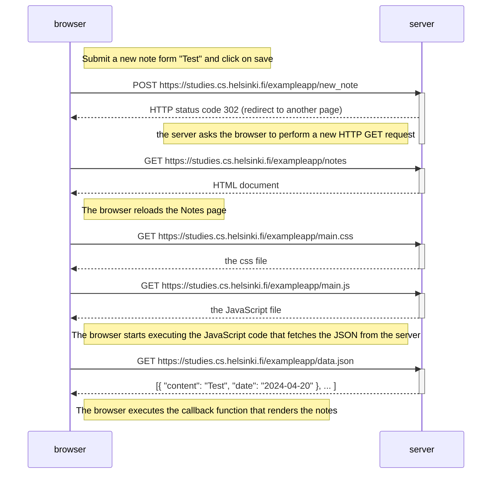

```mermaid
sequenceDiagram
    participant browser
    participant server

    Note right of browser: Submit a new note form "Test" and click on save

    browser->>server: POST https://studies.cs.helsinki.fi/exampleapp/new_note
    activate server 
    server-->>browser: HTTP status code 302 (redirect to another page) 

    Note left of server: the server asks the browser to perform a new HTTP GET request
    deactivate server

    browser->>server: GET https://studies.cs.helsinki.fi/exampleapp/notes
    activate server
    server-->>browser: HTML document
    deactivate server

    Note right of browser: The browser reloads the Notes page

    browser->>server: GET https://studies.cs.helsinki.fi/exampleapp/main.css
    activate server
    server-->>browser: the css file
    deactivate server

    browser->>server: GET https://studies.cs.helsinki.fi/exampleapp/main.js
    activate server
    server-->>browser: the JavaScript file
    deactivate server

    Note right of browser: The browser starts executing the JavaScript code that fetches the JSON from the server

    browser->>server: GET https://studies.cs.helsinki.fi/exampleapp/data.json
    activate server
    server-->>browser: [{ "content": "Test", "date": "2024-04-20" }, ... ]
    deactivate server

    Note right of browser: The browser executes the callback function that renders the notes

```
