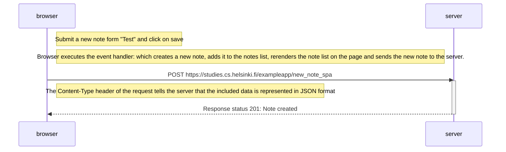

```mermaid
sequenceDiagram
    participant browser
    participant server

    Note right of browser: Submit a new note form "Test" and click on save
    Note right of browser: Browser executes the event handler: which creates a new note, adds it to the notes list, rerenders the note list on the page and sends the new note to the server.

    browser->>server: POST https://studies.cs.helsinki.fi/exampleapp/new_note_spa
    activate server
    Note right of browser: The Content-Type header of the request tells the server that the included data is represented in JSON format
    server-->>browser: Response status 201:  Note created
    deactivate server 

    
   
```
